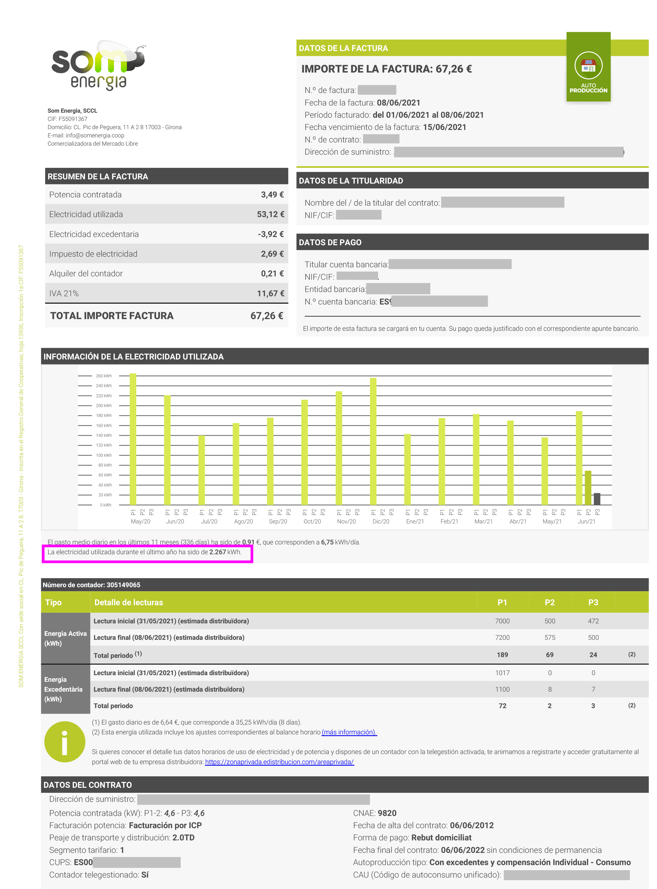
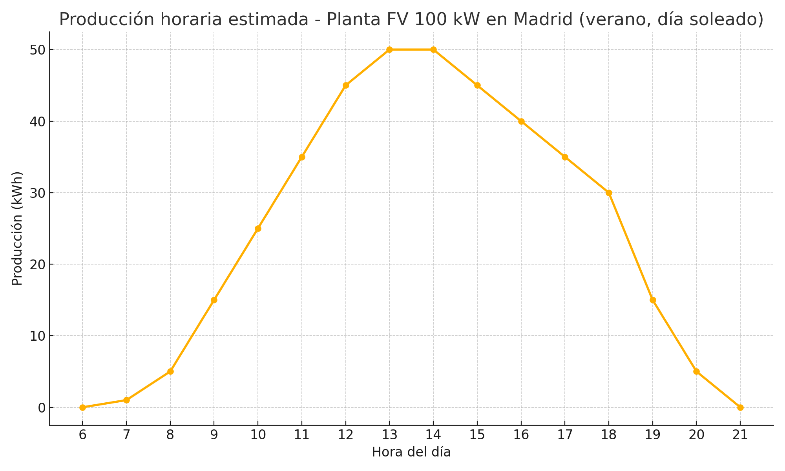
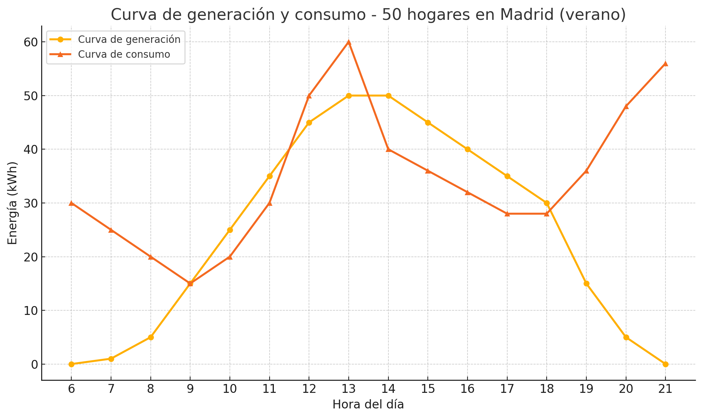

## ¿Qué es una comunidad energética?

Una comunidad energética es un grupo de personas, empresas o entidades que se unen para producir, consumir y gestionar energía de manera colectiva. Estas comunidades pueden estar formadas por personas vecinas de un edificio, barrio, distrito o incluso un municipio.

## ¿Qué es la comunidad energética Brillaverde?

La comunidad energética Brillaverde es una iniciativa que busca promover el autoconsumo colectivo de energía renovable entre sus miembros. Está formada por personas y pequeñas empresas vecinas del barrio de Butarque y de otros barrios aledaños de Villaverde Bajo como Los Rosales o San Cristóbal.

Su principal objetivo es promover un modelo energético menos contaminante y más democrático, fomentando el uso de energías renovables y la eficiencia energética. Pero también busca crear tejido social en el barrio y fomentar la participación ciudadana en la gestión de la energía.

## ¿Quienes pueden formar parte de la comunidad energética Brillaverde?

Cualquier persona, pequeña empresa o entidad puede ser socia, pero para poder consumir la energía generada por la comunidad el domicilio de consumo no puede estar a más de 2 km de la instalación de generación.

## ¿Qué es el autoconsumo colectivo?

El autoconsumo colectivo es una modalidad de autoconsumo energético que 
permite a un grupo de personas de una comunidad energética, compartir la energía generada por una instalación de generación renovable, como por ejemplo paneles solares. 

La titularidad de la instalación debe ser de la comunidad energética.

## ¿Cuál es la instalación de generación renovable de la comunidad energética?

La instalación de generación de energía se situará en el tejado del CEIP El Greco, en la calle Estefanita 7 del barrio de Butarque en Villaverde, y estará formada por paneles solares fotovoltaicos. El ayuntamiento de Madrid, en concurso público, va a ceder la cubierta del colegio a la comunidad energética durante un periodo de 25 años.

A medida que crezca la comunidad energética, se podrán crear nuevas instalaciones en el barrio.

## ¿Qué potencia tendrá la instalación?

La instalación tendrá una potencia de 100 kW, con una producción anual estimada de 156.282 kWh,lo que permitirá generar una cantidad suficiente de energía renovable para abastecer unas 50 o 60 familias y una docena de pequeñas empresas del barrio.

## ¿Cómo se realizará el reparto de la energía generada?

El reparto de la energía generada será de la siguiente manera:

- Colegio El Greco: 10%.
- Familias en situación de vulnerabilidad: 20%.
- Personas socias de la comunidad energética: 70%.

Entre las personas socias el reparto se realizará en base a unos títulos de consumo energético con distintas potencias nominales. Actualmente se contemplan varios tipos de títulos, pero se decidirá finalmente en la asamblea de personas socias.

- Título de 0.5 kW: Para familias con bajo consumo energético.
- Título de 1 kW: Para familias con un consumo medio.
- Título de 1.5 kW: Para familias con un consumo alto.
- Título de 2 kW: Para empresas con un consumo bajo.
- Título de 3 kW: Para empresas con un consumo mayor.

## ¿Cuánta potencia nominal necesito?

La potencia nominal que necesitas depende de tu consumo energético y de las horas y días a los que se realiza ese consumo. Para averiguar tu consumo debes mirar tu factura eléctrica. En ella encontrarás información muy útil como:

   - Un gráfico que muestra el consumo de energía en kWh en los meses anteriores. Este consumo también aparece diferenciado por tramos (punta, llano y valle) si tienes una tarifa por tramos.
   - El consumo medio diario en kWh.
   - La potencia máxima demandada en el último año.
   - El consumo acumulado del último año en kWh.

Este último dato es el más importante para decidir la potencia nominal que necesitas:

   - Si el consumo acumulado en un año es igual o inferior a 1600 kWh, necesitarás un título de 0.5 kW.
   - Si el consumo acumulado es entre 1600 y 3200 kWh, necesitarás un título de 1 kW.
   - Si el consumo acumulado es superior a 3200, necesitarás un título de 1.5 kW.

## ¿Cuánto cuestan los títulos?

El coste de los títulos será proporcional a la potencia nominal de cada uno. Se estima que el coste inicial por kW será de unos 750€. 

A este precio hay que añadir el coste anual del mantenimiento de la instalación, que también será proporcional a la potencia nominal del título, y se estima que sea de unos 20€ al año por kW.

El precio podría ser menor si se consigue financiación a través de subvenciones o ayudas públicas.

## ¿Es necesario comprar un título de consumo energético para ser socio de la comunidad energética?

No, no es necesario comprar un título de consumo energético para ser socio de la comunidad energética. Cualquier persona puede hacerse socia de la comunidad energética Brillaverde, independientemente de si compra un título o no. Solo es necesario comprar un título si se quiere participar en el reparto de la energía generada por la instalación.

## ¿Qué elementos se instalan en una planta fotovoltaica?

- **Módulos fotovoltaicos**. Se encargan de captar la radiación solar y convertirla en energía eléctrica.
- **Inversor**. Transforma la corriente continua generada por los módulos, en corriente alterna, apta para el consumo en los hogares.
- **Caja de protección**. Protege la instalación de sobrecargas y cortocircuitos.
- **Contador de generación**. Mide la energía generada por la instalación.
- **Monitor**. Permite supervisar el funcionamiento de la planta fotovoltaica.

## ¿Cómo se contabiliza la energía generada?

La energía generada por la instalación se mide mediante un contador de generación. Este contador registra la cantidad de energía producida y es contabilizada por la empresa distribuidora de electricidad. La empresa distribuidora luego le pasa esta información a cada comercializadora.

La cantidad de energía diaria producida por la planta se representa en un gráfico mediante una curva horaria llamada _curva de generación_.

## ¿Cómo llega la energía a los hogares?

La energía generada por la instalación se inyecta a la red eléctrica a través de la empresa distribuidora. Esta energía se mezcla con la energía que proviene de otras fuentes y llega a los hogares a través de las líneas de distribución habituales.

## ¿Cómo se consume la energía generada?

Cada socia con un título de consumo energético podrá consumir la energía generada por la instalación en función de su potencia nominal. 

Existen dos modalidades de reparto del consumo

-  **Reparto fijo**. En este modo, cada socia puede consumir la energía generada por la instalación hasta el límite de su potencia nominal y además el coeficiente de reparto es fijo durante todas las horas y días del año.

   Por ejemplo, si de 13:00 a las 14:00 horas la planta genera 1 kWh por kW de potencia instalada, una socia con un título de 1 kW podrá consumir hasta 1 kWh de energía durante esa hora. Pero si de 18:00 a 19:00 horas la planta genera 0.4 kWh por kW de potencia instalada, la socia podrá consumir hasta 0.4 kWh de energía durante esa hora. Y esto todos los días del año.

- **Reparto dinámico**. En este modo, las socias se reparten la energía generada por la instalación cada hora. El porcentaje de energía que cada socia puede consumir puede ser distinto cada hora del día y cada día del año, pero la suma de los porcentajes de todas las socias cada hora debe ser igual al 100% de la energía generada, y además, el consumo anual de cada socia no puede superar el porcentaje de energía generada durante el año correspondiente a su título de consumo energético.

   Por ejemplo, si de 13:00 a las 14:00 horas la planta genera 1 kWh por kW de potencia instalada, una socia con un título de 1 kW podrá consumir si lo desea más de 1 kWh de energía durante esa hora, siempre que haya otros socios dispuestos a consumir menos de lo que permite su título en esa hora. Esa misma persona puede compensar su exceso de consumo en otra hora del día o en otro día del año, consumiendo menos de lo que le permite su título.

   Esta modalidad es mucho más flexible y eficiente, ya que permite aprovechar mejor la energía generada, pero requiere se que ajuste la curva de consumo de las socias a la curva de generación de la instalación.

   

Tanto en un modo como en otro, las personas socias con título de consumo energético deben llegar a un **acuerdo de reparto** de la energía generada que establece los coeficientes de participación en el consumo de cada una.
El acuerdo debe reflejar los coeficientes de reparto para cada hora del año y debe proporcionarse a la empresa distribuidora firmado por todas las participantes, quien a su vez lo comunicará a la empresa comercializadora de casa persona consumidora.

## ¿Qué ocurre si consumo más energía de la que me corresponde en una hora concreta?

El exceso de consumo de energía en una hora concreta lo cobrará la empresa comercializadora de cada consumidora al precio que establezca su contrato.

## ¿Qué ocurre si consumo menos energía de la que me corresponde en una hora concreta?

Si una consumidora consume menos energía de la que le corresponde en una hora concreta, la empresa comercializadora le compensará por el excedente de energía que no ha consumido. Esta compensación se realizará al precio que establezca su contrato (suele estar en torno a un tercio del precio de la energía consumida), salvo si su contrato es PVPC (Precio Voluntario al Pequeño Consumidor), en cuyo caso la compensación se realizará al precio que marca la red eléctrica cada día.

## ¿Cómo se tramita el autoconsumo colectivo?

1.  Obtener el Certificado de la Instalación Eléctrica (CIE) (tarda unas 3 semanas).
2.  Registrar el CIE en la Comunidad Autónoma (tarda unos 2 meses).
3.  La comunidad autónoma informa a la empresa distribuidora que solicitará la verificación COVE (tara unos 5 meses).
4.  La empresa distribuidora pedirá el acuerdo de reparto establecido en fichero txt con el consumo de cada socia consumidora indicando su CUPs y el coeficiente de consumo por cada fracción horaria del año, es decir, para cada CUPS debe haber 8760 coeficientes. Es importante que la suma de los coeficientes en cada fracción horaria sea igual a 1.

## Referencias
- [Real decreto 244/2019, de 5 de abril](https://www.boe.es/buscar/doc.php?id=BOE-A-2019-5089)
- [Ley 24/2013, de 26 de diciembre](https://www.boe.es/buscar/act.php?id=BOE-A-2013-13645)
- [Guía de autoconsumo colectivo del IDAE](https://www.idae.es/sites/default/files/documentos/publicaciones_idae/Guia-Autoconsumo-Colectivo/20240709_Guia_Autoconsumo_Colectivo_v2.1.pdf)
