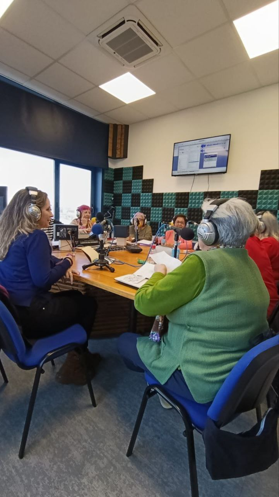

El pasado lunes 16 de marzo participamos en el programa _Con Mayor Voz_ de las lideresas de Villaverde en Onda Merlín Comunitaria, la radio libre y comunitaria del distrito de Villaverde.

En este programa estuvimos presentando nuestra comunidad energética y hablando de transición energética en nuestros barrios.

Gracias a las lideresas de nuestro distrito por invitarnos a presentar nuestra asociación.

Os dejamos con el enlace al podcast del programa.

https://go.ivoox.com/rf/170376040?utm_source=embed_podcast_new&utm_medium=share&utm_campaign=new_embeds

<iframe src="https://www.ivoox.com/player_es_podcast_308401_zp_1.html?c1=945caf" width="100%" height="400" frameborder="0" allowfullscreen="" scrolling="no" loading="lazy"></iframe>

