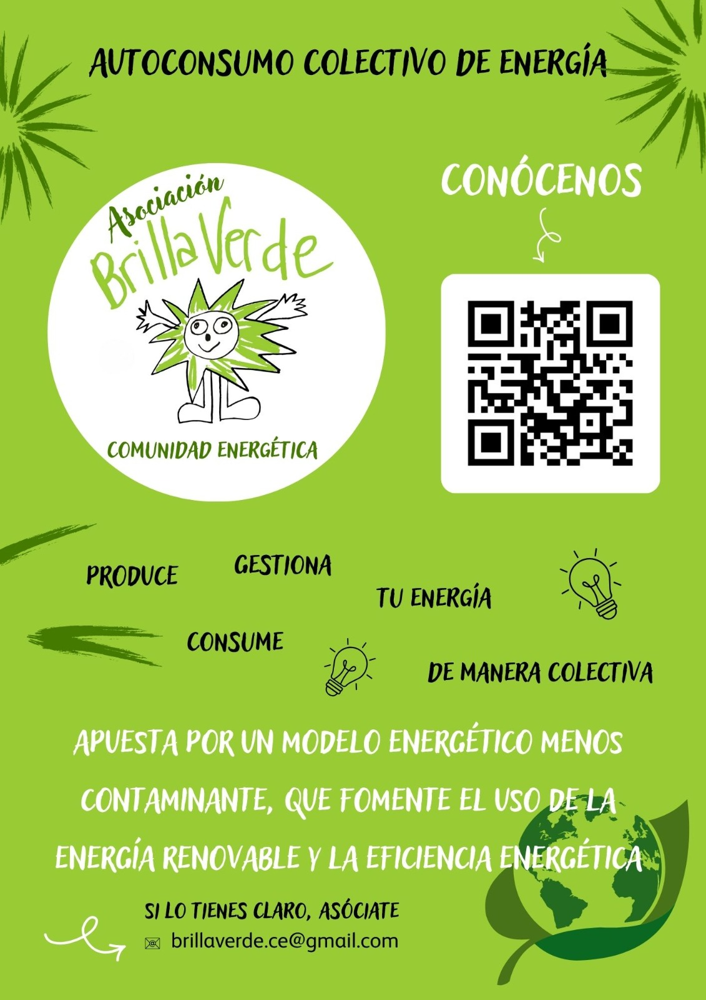
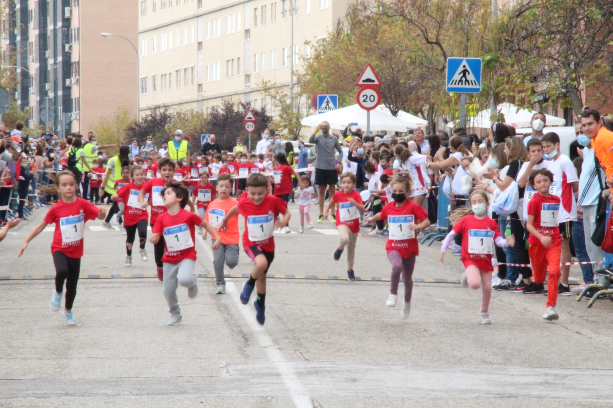

El pasado 19 de octubre se celebró, como cada año, la carrera popular de Butarque, un evento deportivo y solidario, organizado por la Asociación de Vecinas Independientes de Butarque (AVIB), que se ha convertido en toda una referencia de participación ciudadana en Villaverde. 

Aprovechando el evento y la gran cantidad de participantes, desde la comunidad energética BrillaVerde incluimos un panfleto informativo en la bolsa del corredor, y varias voluntarias de la comunidad energética Brillaverde montaron un punto informativo para dar a conocer el proyecto y sus beneficios para el barrio de Butarque y el distrito de Villaverde.

Fue mucha la gente que se acercó a nuestro puesto, mostrando interés por la energía solar y las iniciativas que estamos llevando a cabo en el barrio. Esperemos que todas ellas se animen y se sumen pronto a nuestra comunidad energética. _Tú también estás a tiempo de unirte, ¿a qué esperas?_

