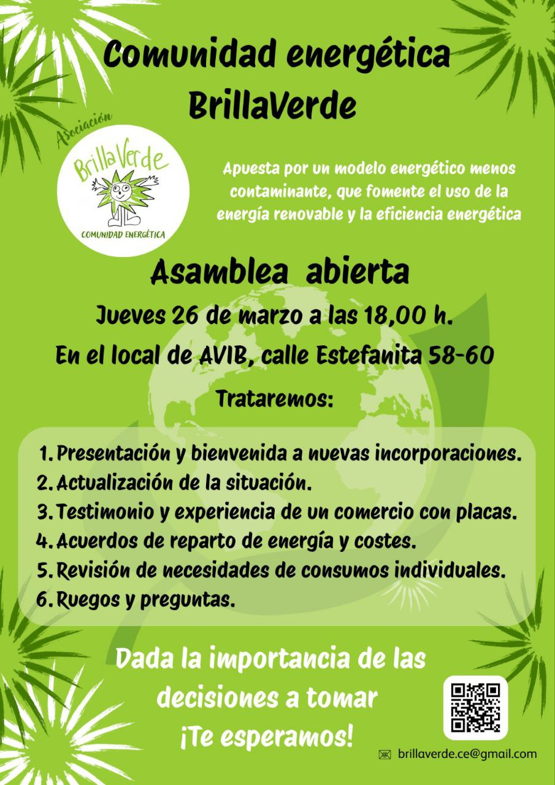

Os invitamos al próximo encuentro de la Comunidad Energética Brillaverde el **jueves 26 de marzo a las 18:00 en el local de AVIB**.

Tras la noticia de la licitación de la concesión del la cubierta del colegio El Greco, es importante reunirnos para empezar a preparar la documentación necesaria para presentarnos a esta licitación. 

## Orden del día

1. Presentación y bienvenida a nuevas incorporaciones.
2. Actualización de la situación.
3. Testimonio y experiencia de un comercio con placas.
4. Acuerdos de reparto de energía y costes.
5. Revisión de necesidades de consumos individuales.
6. Ruegos y preguntas.

Los temas a tratar son muy importantes, sobre todo el acuerdo de reparto de la energía, por lo que se requiere la participación de todas las personas socias. 

_¡Contamos contigo!_

   