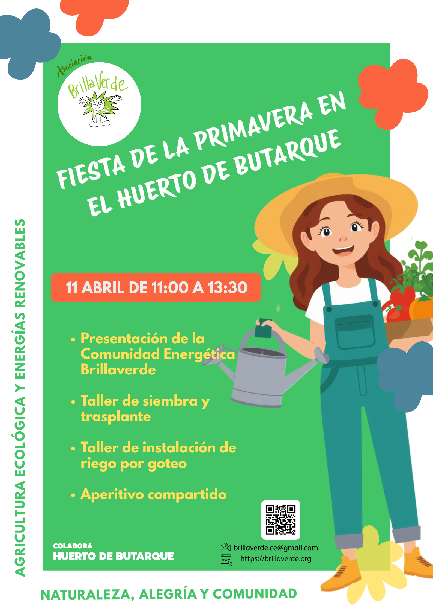

El próximo **sábado 11 de abril de 11:00 a 13:30** os invitamos a disfrutar de una agradable jornada sobre agricultura ecológica y energías renovables en el **Huerto de Butarque**, justo detrás del el colegio El Greco donde irá situada la futura planta solar.

En colaboración con las hortelanas y hortelanos del huerto de Butarque haremos un taller sobre siembra y trasplante de plantones para la huerta de verano y otro taller de instalación de riego por goteo.

Aprovecharemos también para presentar nuestra comunidad energética Brillaverde a las que aún no nos conocéis, así como el estado en que se encuentra la licitación de la cesión de la cubierta del colegio El Greco, donde queremos montar nuestra primera planta solar fotovoltaica. 

Acabaremos el acto con un pequeño aperitivo compartido, así que no te olvides de traer algo para picar. La bebida la pondremos nosotras.

Aquí os dejamos con unas cuantas fotos de esta bonita jornada.



