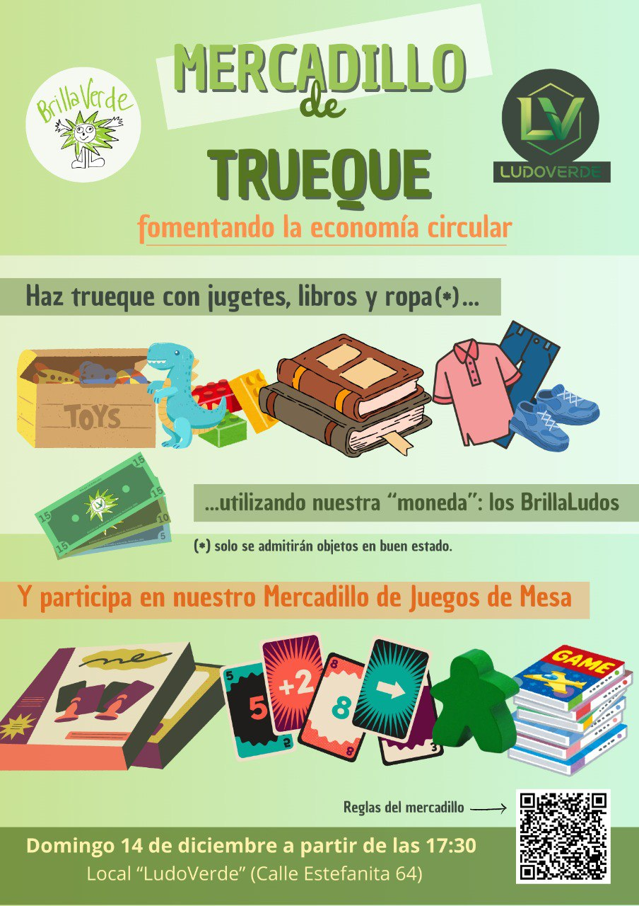

El próximo **domingo 14 de diciembre** realizamos un mercadillo de trueque en colaboración con la asociación [Ludoverde](https://ludoverdeaso.wixsite.com/ludoverde). El mercadillo tendrá lugar en el local de esta asociación, situado en la calle Estefanita, 64 a partir las 17:30. 

Desde Brillaverde queremos fomentar un consumo decreciente entre nuestras vecinas y vecinos, y qué mejor manera de hacerlo que a través del trueque. En este mercadillo, podrás intercambiar objetos que ya no necesitas por otros que te resulten útiles, promoviendo así la reutilización y reduciendo el desperdicio y el gasto energético. Podrás intercambiar ropa, libros o juguetes. Es importante que los objetos estén en buen estado para asegurar una experiencia positiva para todos los participantes.

## Normas del Mercadillo de Trueque  

Este mercadillo tiene como finalidad fomentar la reutilización y el consumo responsable mediante el trueque. Habrá dos zonas bien diferenciadas: trueque de ropa, juguetes y libros y mercadillo de juegos de mesa.

### Trueque de ropa, juguetes y libros

1.  Funcionamiento del sistema de BrillaLudos

    Cada objeto entregado será revisado por la organización y si cumple las condiciones, se entregará un número de “BrillaLudos” que dependerá del estado del objeto.  

    Esos BrillaLudos podrán utilizarse para adquirir uno o más artículos del mercadillo de trueque.

2.  Estado de los objetos

    Solo se aceptarán artículos en buen estado, limpios y listos para volver a usarse. No se aceptarán objetos rotos, incompletos, manchados, sin páginas o que no funcionen.

3.  Tipos de artículos admitidos

    - Ropa (preferentemente de temporada)  
    - Juguetes completos y en buen estado  
    - Libros en buen estado (infantiles, juveniles o para adultos)

4. Obligatoriedad del intercambio

    La entrega de un artículo implica obligatoriamente el uso de BrillaLudos para adquirir otro objeto del mercadillo de trueque. No está permitido dejar objetos sin realizar un trueque.

5.  Revisión de artículos

    La organización se reserva el derecho de aceptar o rechazar los objetos en función de su estado y de asignarles un valor en BrillaLudos.

### Mercadillo de juegos de mesa

1.  Los asistentes que traigan juegos de mesa para venta, deberán apuntar el título del juego, valor de venta del juego, su nombre completo y número de teléfono en la lista que tendremos disponible.

2.  Etiquetaremos y expondremos cada juego con el valor requerido por el propietario.

3.  Los usuarios podrán adquirir estos juegos de segunda mano por el precio marcado por el dueño al que se le hará entrega del dinero íntegro. La organización sólo actuará como mero intermediario.

4.  Los juegos se deberán entregar para su venta envueltos en papel film, y se le entregarán al comprador de la misma forma, para asegurar que el juego se entregó en las mismas condiciones que se recibió. En ningún caso, la organización se hace responsable del estado final de los juegos de mesa.

5.  Los juegos de mesa que no se hayan vendido, se devolverán a su dueño (previa comprobación del DNI) al final del evento. En caso de que el dueño no aparezca, el juego permanecerá en el local durante 3 días en los que el dueño deberá ponerse en contacto con los organizadores escribiendo a (ludoverde.aso@gmail.com) para su recogida. En caso de que esto no se produzca, se asumirá que el juego ha sido donado a la organización.
